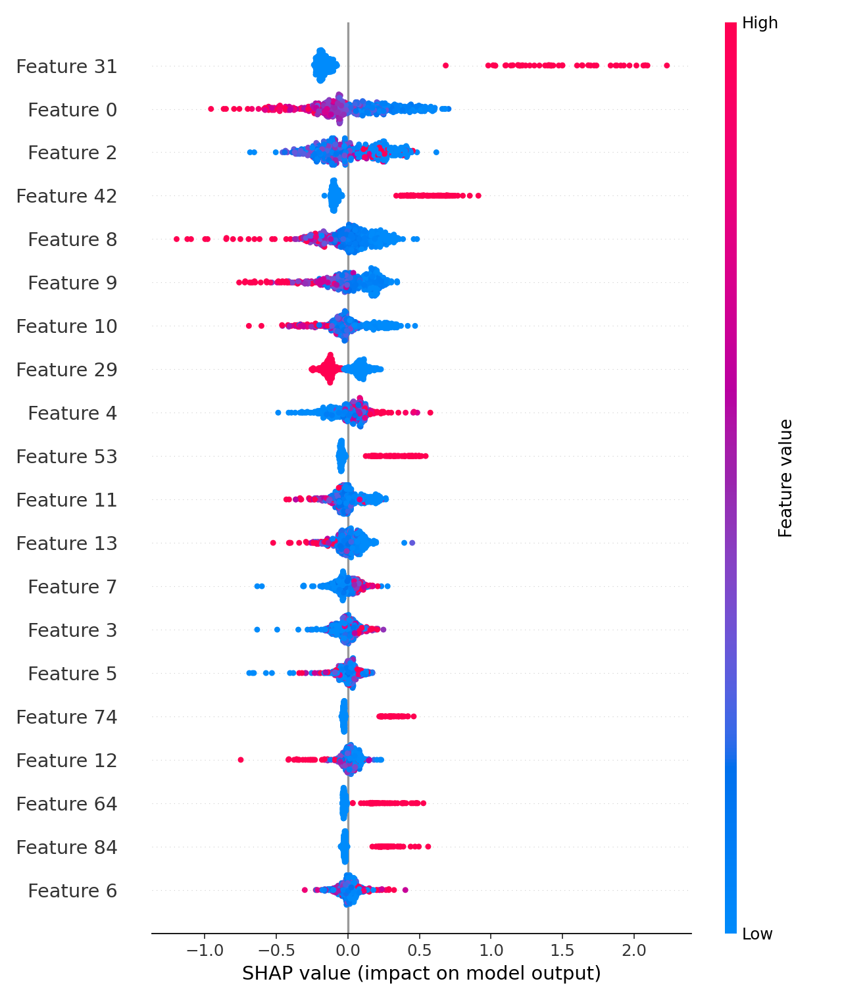

# Credit Risk ML

Production-minded credit-risk modeling pipeline for tabular applicant data.  
Covers model training, scoring new applicants, generating explainability (SHAP) plots, and saving artifacts for downstream use.

---

## ✨ Features

- **End-to-end pipeline:** Train, evaluate, persist model, and score new data
- **Tabular preprocessing & ML:** scikit-learn compatible pipeline
- **Batch scoring:** Score applicants from CSV files
- **Explainability:** SHAP (global & local plots)
- **Reproducible environments:** Managed with `requirements.txt`
- **Artifacts versioned:** Models in `models/`, visual outputs in `reports/figures/`

---

## 🗂️ Repository Structure

```
credit-risk-ml/
├── data/                 # (Optional) raw/processed sample data
├── models/               # Trained model artifacts (e.g., pipeline .pkl)
├── reports/
│   └── figures/          # SHAP/ROC/PR plots, etc.
├── src/                  # (If present) shared modules/utilities
├── applicants_sample.csv # Example applicants to score
├── train.py              # Train model and save artifacts
├── score.py              # Batch scoring for a CSV of applicants
├── make_shap.py          # Generate SHAP explanations from saved model
├── requirements.txt      # Python dependencies
└── .gitignore
```

---

## 🚀 Quickstart

### 1. Environment Setup

```sh
# Python 3.10+ recommended
python -m venv .venv

# Windows:
.venv\Scripts\activate

# macOS/Linux:
source .venv/bin/activate

pip install --upgrade pip
pip install -r requirements.txt
```

### 2. Train the Model

```sh
python train.py
```

- Saves the fitted pipeline and metadata to `models/`
- Writes evaluation outputs/plots to `reports/figures/` (if enabled)

### 3. Batch Scoring

```sh
python score.py --input applicants_sample.csv --output predictions.csv
```

- **Input:** CSV with the same feature columns as training
- **Output:** `predictions.csv` with per-row probability and/or class prediction

### 4. Explainability (SHAP)

```sh
python make_shap.py
```

- Loads the saved model from `models/`
- Produces global and local SHAP visualizations in `reports/figures/`

> **Note:**  
> If you see `No module named 'sklearn'`, ensure your venv is active and dependencies are installed.  
> Large SHAP computations can be memory-intensive; start with a sample if needed.

---

## 📊 Evaluation

Common metrics for credit scoring:

- ROC-AUC
- PR-AUC (for imbalanced datasets)
- Brier score
- KS statistic
- Calibration curves

Metrics and plots are saved in `reports/figures/` after running `train.py`.

---

## 🧩 Data

- Expects a tabular dataset of applicant features and a binary target (e.g., default/non-default)
- Ensure column names/types in scoring files match the training script
- Use `applicants_sample.csv` to verify the pipeline

---

## ⚙️ Configuration

To customize:

- Model type/hyperparameters
- Feature lists, encoders, imputers
- Train/validation split, CV folds
- Paths for artifacts & reports

Edit variables/args in `train.py`, `score.py`, or config files under `src/`.

---

## 🧪 Reproducibility

- Pin your Python version and use `requirements.txt`
- Seed random number generators in `train.py` for consistent runs

---

## 🏭 Production Notes

- Persist the full preprocessing + model pipeline (`.pkl`) in `models/`
- Validate schema at inference (columns/order/dtypes)
- Add input sanitation (empty rows, out-of-range values)
- Record model version/hash in outputs for traceability
- For real-time use, wrap `score.py` logic in a REST API (FastAPI/Flask) and containerize

---

## 🧰 Makefile / CLI (Optional)

Add a simple Makefile for command shortcuts:

```makefile
train:
    python train.py

score:
    python score.py --input applicants_sample.csv --output predictions.csv

explain:
    python make_shap.py
```

---

## 📦 Requirements

Install dependencies:

```sh
pip install -r requirements.txt
```

Ensure `scikit-learn`, `pandas`, `numpy`, and `shap` are present.  
For SHAP plots, `matplotlib` is also required.

---

## 📊 Results

On the held-out validation set:

- **ROC-AUC:** 0.772
- **PR-AUC:** 0.544
- **Brier score:** 0.136
- **KS statistic:** 0.420

<p align="center">
  
  
</p>

<p align="center">
  
</p>
